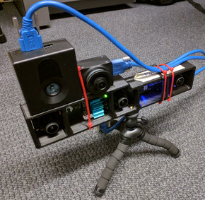
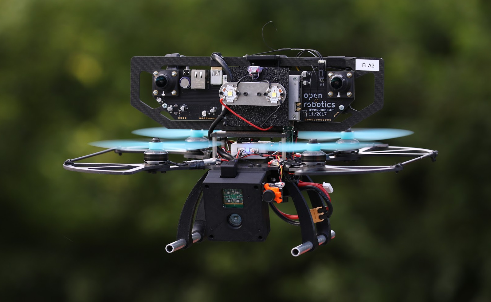

## The GRASP MultiCam Data Set

The GRASP MultiCam data set combines recorded images from a
synchronized stereo monochrome camera and IMU  with those from a depth
sensor. The stereo camera / IMU device allows for accurate
Visual-Inertial Odometry (VIO), which can then be used to recover 3D
structure from the depth sensor point clouds.

The data covers indoor and outdoor scenes. The recording devices are
always carried by hand.

## Falcam Rig
For the earlier datasets, a
[Falcam (ovc version 0)](https://github.com/osrf/ovc/tree/master/hardware/ovc0/HarleyTandem)
synchronized stereo camera/IMU is used, combined with
a
[Monstar Time-Of-Flight (TOF) sensor](https://pmdtec.com/picofamily/)
and an unsynchronized  PointGrey/FLIR color camera. It
is cobbled together with zip ties and double sided tape into a rig
that looks like this:\\
<td></td>

## Falcon 250 Quadrotor

Later, an aerial robot is carried around that has all
the sensors connected to it. A laptop is attached via Cat6 cable to collect the
data. Again the synchronized stereo camera/IMU is a custom device made
by the [Open Source Robotics Foundation](https://www.openrobotics.org/), but
this time it is an [Open Vision Computer OVC 1](https://github.com/osrf/ovc).
No color camera is present, but either a
[Monstar Time-Of-Flight (TOF) sensor](https://pmdtec.com/picofamily/)
or an [Astra RGBD sensor](https://orbbec3d.com/product-astra-pro/):\\

