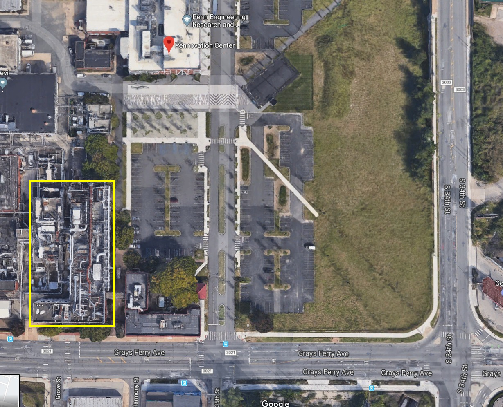
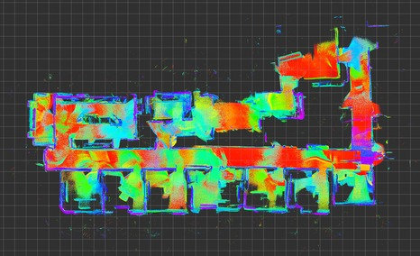
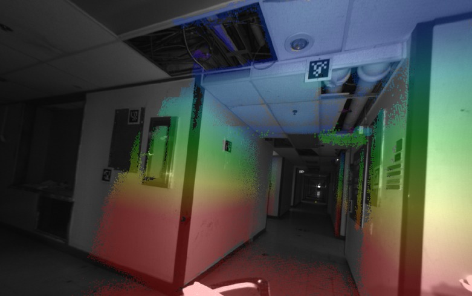

# Overview

The Building 227 (marked with yellow rectangle) sequences were collected in a vacant building next to the Pennovation Center at UPenn.

---
# Sequences
---
<table>

<tr>
<td colspan="2"><strong>2018-11-09-08-37-41</strong></td>
</tr>
<tr>
<td>Duration: 3min:42s (222s)</td><td>approx path length: unknown</td>
</tr>
<tr>
<td colspan="2">Short loop on the 4th floor. Modest VIO drift, with
some fortuitous error cancellation.</td>
</tr>
<tr>
<td></td>
<td></td>
</tr>
<tr>
<td>
<a href="http://visiondata.cis.upenn.edu/grasp_multicam/building_227/2018-11-09-11-00-28/2018-11-09-11-00-28_raw_data.bag">rosbag with raw data (15Gb)</a>
</td>
<td>
<a href="http://visiondata.cis.upenn.edu/grasp_multicam/building_227/2018-11-09-11-00-28/2018-11-09-11-00-28_calib.yaml">calibration yaml file</a>
</td>
</tr>

<tr>
<td>
<a href="http://visiondata.cis.upenn.edu/grasp_multicam/building_227/2018-11-09-11-00-28/2018-11-09-11-00-28_odom.bag">rosbag with odometry (40Mb)</a>
</td>
<td><a href="http://visiondata.cis.upenn.edu/grasp_multicam/building_227/2018-11-09-11-00-28/camera_video.mp4">video</a></td>
</tr>
</table>
