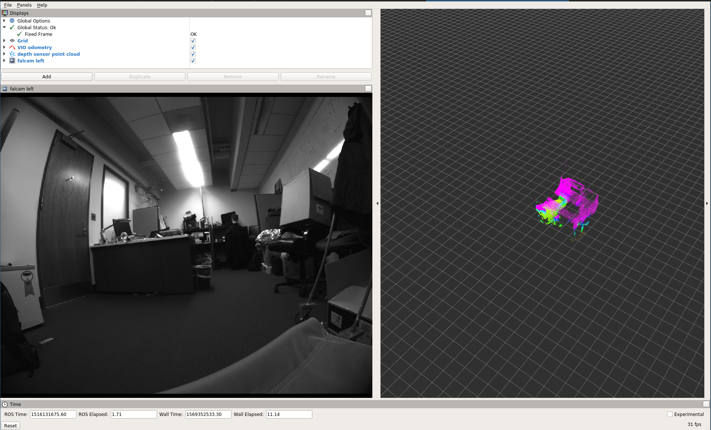
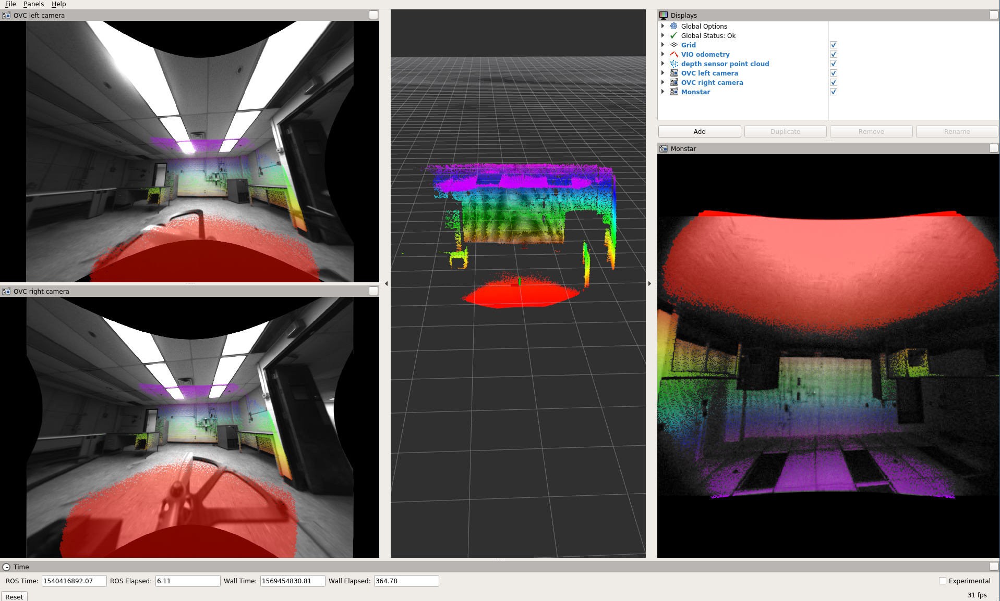

# Installation

Grab the repo from github and clone it into the "src" directory of
your ROS/catkin workspace:
    
	cd ~/catkin_ws/src
    git clone https://github.com/daniilidis-group/grasp_multicam.git

Build it:

    catkin config -DCMAKE_BUILD_TYPE=Release
	catkin build

Source it:

    source ../devel/setup.bash

# Downloading a sequence

Once you find a sequence you are interested in
(e.g. 2018-01-16-14-41-13) download it:

    seq=2018-01-16-14-41-13
    rosrun grasp_multicam download_sequence.bash $seq
	
# Visualizing the point cloud (simple but inaccurate)

Play the bag and the necessary transforms like this:

	cd $seq
	roslaunch grasp_multicam replay_point_cloud.launch seq:=$seq dir:=`pwd`

In a separate terminal, start rviz:

    seq=2018-01-16-14-41-13
	cd $seq
	rviz -d `pwd`/show_point_cloud.rviz

You should now see something like this:

# Visualizing the point cloud (complicated but higher quality)

Running the ``transform_point_cloud`` node is necessary to get
more accurate reconstruction. This is for two reasons:

- the processing in the depth sensor driver (the "libroyal"
  propriertary part) causes a delay of the depth sensor data with
  respect to the IMU/camera data.
- Rviz seems to use arrival time rather than message time (aka
  header.stamp) when looking up the transform for rendering point
  clouds. So if the transform arrives delayed, the rendering will not
  be accurate.

To get the more accurate rendering, play the point cloud like before,
but also run the pointcloud transform

    roslaunch grasp_multicam transform_point_cloud.launch
	
The transformed point cloud is now available, but under a different
topic, so you must use a different rviz config file (or change the
topic):

    seq=2018-01-16-14-41-13
	cd $seq
	rviz -d `pwd`/show_point_cloud_tf.rviz

# Rendering the projected point cloud images in Rviz

For this you need to compile the [multicam_calibration ROS package
from github](https://github.com/KumarRobotics/multicam_calibration),
and then undistort the cameras:

    seq=2018-01-16-14-41-13
	cd $seq
	rviz -d `pwd`/show_cameras.rviz &
	roslaunch grasp_multicam undistort_all_cams.launch dir:=`pwd`

in another terminal, play the bag:

    seq=2018-01-16-14-41-13
    cd $seq
	rosbag play --clock ${seq}.bag

This should get you an image like this:

The value of this visualization lies in the fact that you can check
the camera calibration. At least while the camera is still, the point
cloud should coincide with visual features such as wall edges etc.

# Recomputing the odometry

To recompute the odometry for a downloaded sequence, first compile the
[msckf_vio ROS package](https://github.com/KumarRobotics/msckf_vio)
and make sure it is overlayed onto your ROS workspace.

Now you can run the odometry:

    seq=2018-01-16-14-41-13
    cd $seq
	roslaunch grasp_multicam run_vio.launch dir:=`pwd` seq:=$seq

This should eventually (takes a while to load the bag first!) produce
a bag that has the odometry in it.

