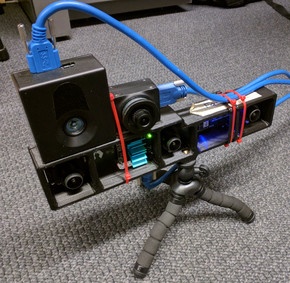
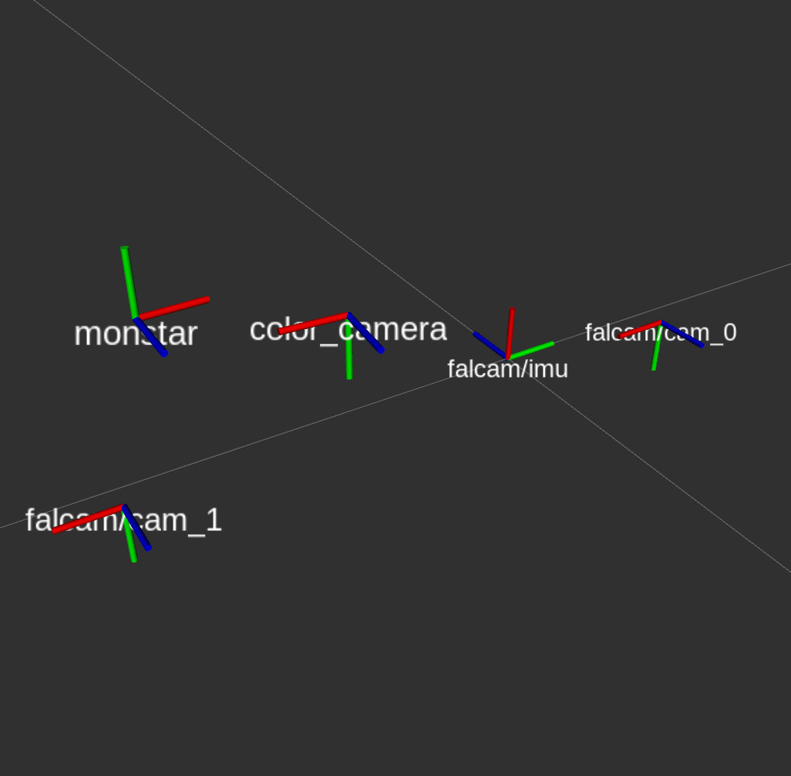
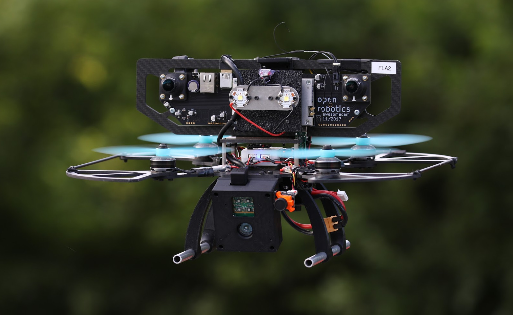
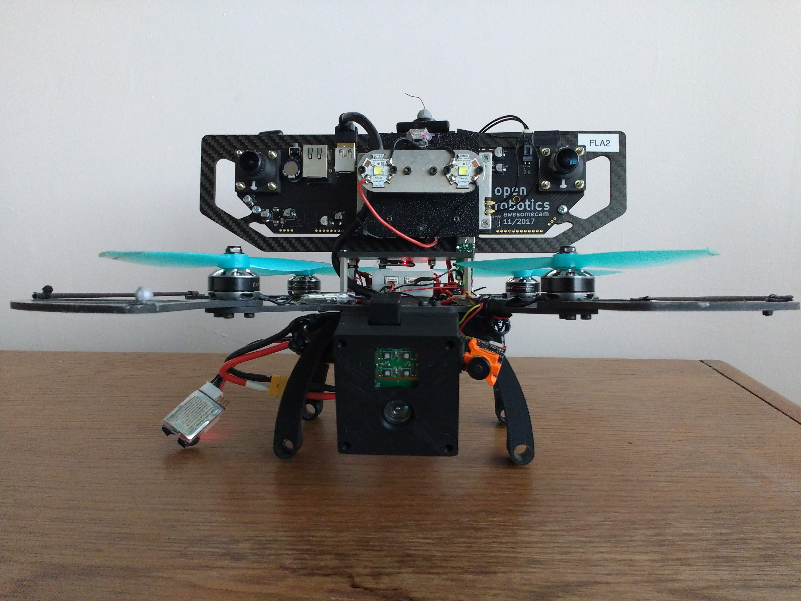
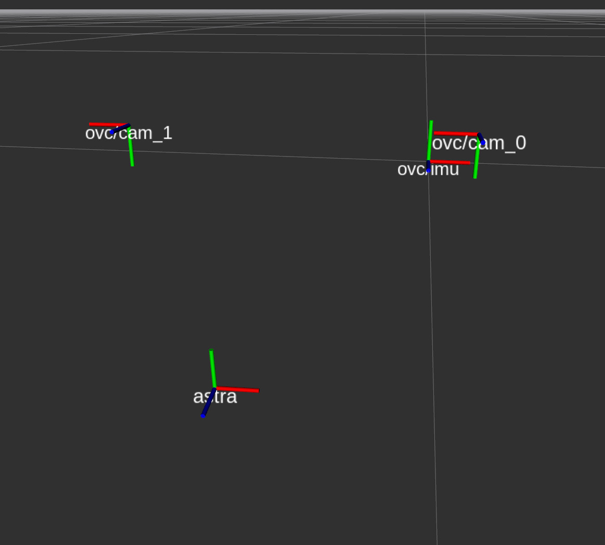
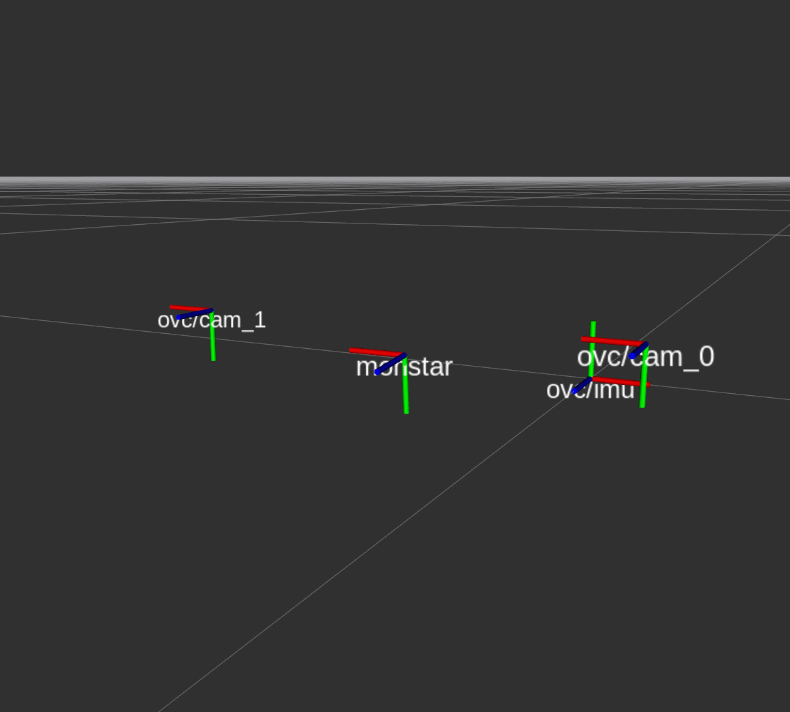
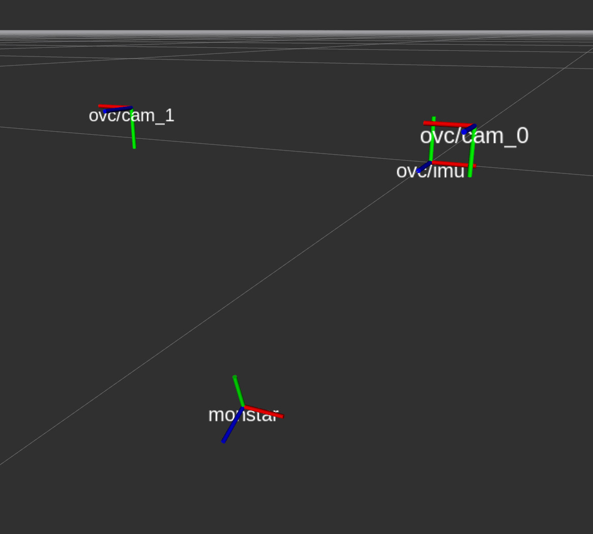

## Falcam Rig 
### Overview
For the earlier sequences in the data set, an experimental rig was
built, held together by double sided tape and zip ties. Here is a
picture of the rig, and how the axis of the various sensors are oriented.\\
<table style="border: none; border-collapse: collapse">
<tr>
<td style="border:none">

</td>
<td style="border:none">

</td>

</tr>
</table>
### Sensor details
- Falcam aka
 [OVC 0/HarleyTandem](https://github.com/osrf/ovc/tree/master/hardware/ovc0/HarleyTandem)
 (at the bottom): a trinocular camera
  with IMU. This experimental device was developed
 by [OpenRobotics](https://www.openrobotics.org/) under the 
  [DARPA Fast Lightweight Autonomy (FLA) program](https://www.darpa.mil/program/fast-lightweight-autonomy).
  Of the three cameras, only the left and right most are used. IMU
  and cameras are hardware synchronized. A custom FPGA runs
  synchronized exposure control across both sensors.
  - imaging
    sensors: [ON Python 1300](../media/on_python_1300_datasheet.pdf),
    monochrome CMOS global shutter
	   - resolution:  1280 x 1024
	   - lens: M12 2.8mm fish-eye lens, no IR filter
	   - field of view: 95.3deg horizontal, 82.6deg vertical
	   - frame rate: 20Hz
	   - exposure control: built-in on custom FPGA enabled, synchronized between
       - left and right camera
  - IMU: [InertialSense uINS 2.2](imu#uIns)\\
	   - sampling rate: 200Hz
- Color camera: PointGrey Chameleon CM3-U3-13Y3C-CS\\
    This camera is *not* synchronized with the Falcam.
	sensor: [ON Python 1300](../media/on_python_1300_datasheet.pdf), color CMOS global shutter.\\
      - resolution  1280 x 1024
	  - exposure control: PointGrey on-board enabled
      - lens: M12 4mm fisheye with IR filter
	  - frame rate: 20Hz
	  - field of view: 75deg horizontal, 63.2deg vertical
	  - SDK: Flycap2 version 2.11.3.121
- Depth sensor: [Monstar](https://pmdtec.com/picofamily/)\\
    Time-of-Flight sensor. Four powerful IR LEDs produce a flash of
    modulated light. The phase shift of the reflected light is
    measured to determine the time of flight and the distance. When
    operated at lower frequencies, the sensing distance
    increases. It is *not* synchronized with the Falcam.
    - resolution: 352 x 287
	- field of view: 100deg horizontal, 85deg vertical
	- measurement range: 0.5-6m
	- frame rate: 5Hz or 10Hz
	- exposure control: proprietary on-board enabled
	- driver library version: libroyale-3.7.0.0-LINUX-x86-64Bit
	

## Falcon 250 (hand carried) 

### Overview
This sensor suite is mounted on a Falcon 250 quad rotor. A laptop is
attached via a Cat6 cable to collect the data on the laptop. The core
piece of the Falcon 250 is an integrated sensing device, the Open Vision Computer (OVC),
version 1. It consists of an NVidia TX2, modified to obtain camera
images directly via PCIe lanes from an FPGA that has two synchronized
stereo cameras and an IMU attached. For depth measurement, either a
Monstar ToF or an Astra RGBD sensor are mounted underneath the rotors. Two
forward facing LED lights are used for some of the recorded sequences.\\
<table>
<tr>
<td> <!--  style="width: 50%"> -->

</td>
<td style="width: 50%">

</td>
</tr>
</table>

While the OVC remained in the same position, the Monstar was either
affixed above (where the LEDs are) or below the propellers, and in different orientation:\\
<table>
<tr>
<td>Configuration 1, with Astra camera </td>
<td>Configuration 2, with Monstar above propellers</td>
<td>Configuration 3, with Monstar below propellers</td>
</tr>
<tr>
<td>

</td>
<td>

</td>
<td>

</td>
</tr>
</table>
### Sensor details
- Open Vision Computer (OVC) version 1
  - imaging sensors:
   [ON Python 1300](../media/on_python_1300_datasheet.pdf),  monochrome CMOS global shutter\\
    - resolution:  1280 x 1024\\
	- lens: M12 2.8mm fish-eye lens, no IR filter\\
	- field of view: 95.3deg horizontal, 82.6deg vertical\\
	- frequency: 20Hz\\
  - IMU: onboard [VectorNav VN-100](imu#VN100)\\
    NOTE: different IMU orientation than in the Falcam rig!
    - sampling rate: 200Hz

- Depth sensor: [Monstar](https://pmdtec.com/picofamily/)\\
    Time-of-Flight sensor. Four powerful IR LEDs produce a flash of
    modulated light. The phase shift of the reflected light is
    measured to determine the time of flight and the distance. When
    operated at lower frequencies, the sensing distance
    increases. It is *not* synchronized with the Falcam.
    - resolution: 352 x 287
	- field of view: 100deg horizontal, 85deg vertical
	- measurement range: 0.5-6m
	- frame rate: 5Hz or 10Hz
	- exposure control: proprietary on-board enabled
	- driver library version: libroyale-3.11.0.0-LINUX-arm-64Bit

- Depth sensor: [Orbbec Astra](https://orbbec3d.com/product-astra-pro)\\
    Structured light RGB-D sensor, similar to the Microsoft Kinect.
    It is *not* synchronized with the Falcam.
    - resolution (depth image): 640 x 480
	- field of view: 60deg horizontal, 49.5deg vertical
	- measurement range: 0.6-8m
	- frame rate: 10Hz
	- exposure control: proprietary on-board enabled
	- driver library: OpenNI with ROS driver
