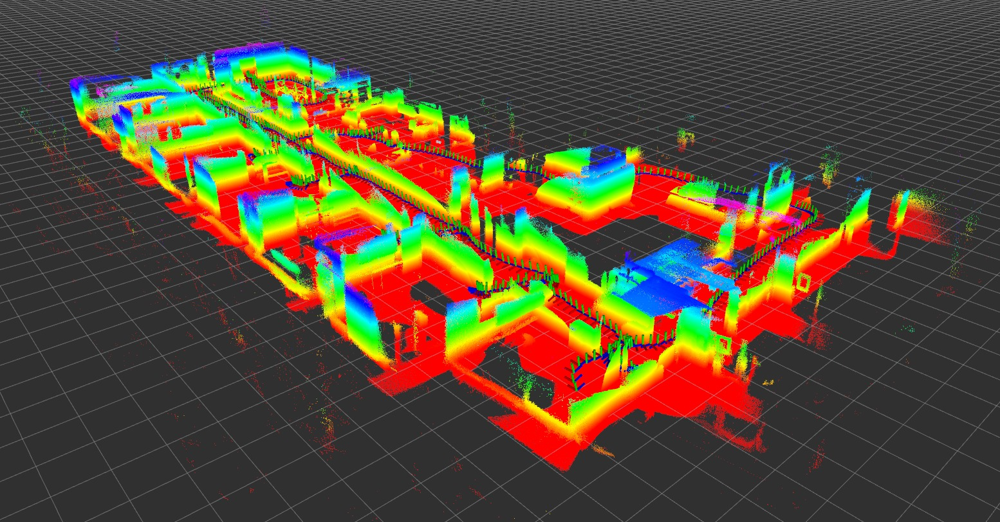

## GRASP MultiCam

The GRASP MultiCam data set combines recorded images from a
synchronized stereo monochrome camera and IMU  with those from a depth
sensor. The stereo camera / IMU device allows for accurate
Visual-Inertial Odometry (VIO), which can then be used to recover 3D
structure from the depth sensor point clouds.

All sequences are recorded indoors.

## Recording rigs

The stereo cameras used for the recording of this data set are
experimental devices made by the
[Open Source Robotics Foundation](https://www.openrobotics.org/). For
some sequences, the data set was recorded by simply carrying around
the robot to which the sensors were attached to.  In other cases, a simple
rig was cobbled together.

<table>
<tr>
<td></td>
<td></td>
</tr>
</table>
